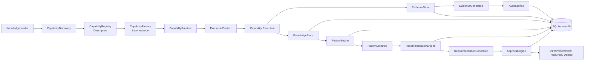

# Sprint 8 Completion Report — Implementasi Nyata

**Proyek:** SAM (System Architecture & Memory)  
**Sprint:** 8 — Implementasi Nyata  
**Status:** ✅ **SELESAI**  
**Tanggal:** 2026-07-22  
**Lead Engineer:** Lead Engineer  
**Lead Assistant:** ZARA

## 1. Ringkasan Eksekutif

Sprint 8 berhasil mengubah fondasi SAM dari rancangan menjadi runtime yang dapat dieksekusi. Capability dapat ditemukan dari metadata, didaftarkan sebagai descriptor, dibuat secara lazy, dieksekusi melalui runtime/CLI, menghasilkan evidence, menurunkan knowledge, memicu pattern detection, menghasilkan recommendation, melewati approval gate, dicatat oleh Audit Service, dan dipersistenkan ke SQLite.

Pipeline akhir:

```text
Capability
    → Evidence
    → Knowledge
    → Pattern
    → Recommendation
    → Approval Gate
    → Audit Event
    → SQLite Persistence
```

## 2. Fitur yang Diimplementasikan

### Runtime Core

- `CapabilityDescriptor` sebagai metadata capability.
- `CapabilityDiscovery` untuk membaca metadata capability dari knowledge/document store.
- `CapabilityRegistry` yang menyimpan descriptor, bukan instance.
- `CapabilityFactory` untuk lazy instantiation berdasarkan implementation path.
- `CapabilityRuntime` untuk eksekusi capability dengan `ExecutionContext`.
- `WorkflowEngine` untuk menjalankan beberapa capability secara berurutan.
- CLI pipeline terpadu:
  `KnowledgeLoader → CapabilityDiscovery → CapabilityRegistry → CapabilityFactory → CapabilityRuntime`.

### Event Bus dan Audit

- `EventBus` untuk publish/subscribe event dalam satu execution run.
- `AuditService` berlangganan wildcard (`*`) dan mencatat event runtime.
- Event utama yang diverifikasi:
  - `CapabilityStarted`
  - `EvidenceGenerated`
  - `PatternDetected`
  - `RecommendationGenerated`
  - `ApprovalGranted`
  - `CapabilityExecuted`

### Evidence Store

- Model evidence dan penyimpanan in-memory.
- Publikasi evidence dari `HealthCheckCapability`.
- Integrasi dengan Event Bus dan `EvidenceRepository`.
- Evidence mencakup capability ID, execution ID, tipe, confidence, payload, dan timestamp.

### Knowledge Store

- `KnowledgeFact` dan status/source knowledge.
- Derivasi knowledge dari evidence health check.
- Query knowledge berdasarkan capability dan status.
- Persistensi melalui `KnowledgeRepository`.
- Kompatibilitas Pydantic v2 menggunakan `model_dump(mode="json")`.

### Pattern Engine

- Rule-based pattern detection.
- Rule `health-ok` untuk health check dengan confidence minimal 0.9 dan tag `health`.
- Persistensi `PatternDetection` melalui `PatternRepository`.
- Event `PatternDetected` diteruskan ke Recommendation Engine.

### Recommendation Engine

- Template recommendation berdasarkan rule ID.
- Pembuatan recommendation dari pattern detection.
- Persistensi melalui `RecommendationRepository`.
- Metadata recommendation menyimpan hubungan rule, pattern, knowledge facts, dan execution.

### Approval Gate

- Human-in-the-loop boundary untuk recommendation severity tinggi.
- Severity `high` dan `critical` memerlukan approval manusia.
- Severity lebih rendah dapat diproses melalui auto-approval.
- Persistensi request dan keputusan melalui `ApprovalRepository`.
- Event `ApprovalRequired`, `ApprovalGranted`, dan `ApprovalDenied` tersedia untuk audit.

### Persistence Layer

- Database SQLite single-file: `D:\Project AI\SAM\sam.db`.
- Wrapper async-friendly berbasis builtin `sqlite3` dan `asyncio.to_thread`.
- Repository yang tersedia:
  - `EvidenceRepository`
  - `KnowledgeRepository`
  - `PatternRepository`
  - `RecommendationRepository`
  - `ApprovalRepository`
- Database diinisialisasi saat runtime dibangun dan ditutup pada blok `finally`.
- Data bertahan antar eksekusi CLI.

## 3. Arsitektur Akhir



### Prinsip arsitektur penting

1. Registry hanya menyimpan descriptor.
2. Discovery tidak melakukan dynamic import atau instantiation.
3. Factory melakukan instantiation secara lazy.
4. Satu Event Bus digunakan per run dan dibagikan ke service terkait.
5. Store/engine menerima repository secara opsional sehingga mode in-memory tetap tersedia untuk unit test/prototyping.
6. CLI selalu menutup koneksi database setelah run selesai.

## 4. Statistik Kode

Statistik berikut dihitung dari package `src/sam` pada saat laporan dibuat:

| Metrik | Nilai |
|---|---:|
| File Python | 40 |
| Baris kode Python | 3.043 |
| Package/module utama | 15 package utama |
| Backend persistence | SQLite (`sqlite3`) |
| Repository persistence | 5 |
| Capability yang diverifikasi end-to-end | 1 (`openclaw.health-checks`) |

Package utama: `approval`, `capabilities`, `cli`, `events`, `evidence`, `knowledge`, `mcp`, `models`, `patterns`, `persistence`, `recommendations`, `runtime`, `sdk`, dan `services`.

## 5. Verifikasi Final

### Perintah

```powershell
cd "D:\Project AI\SAM\src"
.venv\Scripts\python.exe -m sam.cli.main run openclaw.health-checks
```

Untuk menghindari masalah encoding console Windows, uji final dijalankan dengan `PYTHONIOENCODING=utf-8`.

### Hasil

- Exit code: `0`.
- Capability selesai dengan status `healthy`.
- Evidence berhasil dipublikasikan dan dipersistenkan.
- Knowledge fact berhasil dibuat dan dipersistenkan.
- Pattern `health-ok` berhasil terdeteksi dan dipersistenkan.
- Recommendation berhasil dibuat dan dipersistenkan.
- Approval berhasil dibuat dan auto-approved karena severity `info`.
- `CapabilityExecuted` tercatat oleh Audit Service.
- Database berhasil ditutup tanpa error.

Execution ID final:

```text
b92b7536-5eed-4231-887a-97042833c1e9
```

### Isi SQLite setelah verifikasi final

| Tabel | Jumlah baris |
|---|---:|
| `evidence` | 8 |
| `knowledge` | 5 |
| `patterns` | 5 |
| `recommendations` | 5 |
| `approvals` | 5 |

Pertumbuhan jumlah baris membuktikan bahwa data baru tetap ditambahkan ke database yang sama antar run.

## 6. Catatan Teknis dan Batasan yang Diketahui

1. Persistence memakai builtin `sqlite3` yang dibungkus `asyncio.to_thread`; belum menggunakan connection pool atau `aiosqlite`.
2. Database saat ini single-file dan cocok untuk single-process/local runtime. Belum dirancang untuk konkurensi tinggi atau multi-worker.
3. Event Bus dan sebagian state engine masih scoped per run; database menjadi sumber persistensi lintas run.
4. Approval Engine belum memiliki UI/operator channel; keputusan human approval masih melalui API/metode engine.
5. Rule pattern dan recommendation template masih didaftarkan secara programmatic di CLI runtime.
6. Discovery saat ini bergantung pada metadata capability yang valid di dokumen knowledge.
7. Pydantic menampilkan warning kompatibilitas terkait konfigurasi lama `allow_mutation`; tidak menghambat eksekusi, tetapi perlu dirapikan.
8. Console Windows dapat memunculkan masalah encoding `charmap` untuk output Unicode. `PYTHONIOENCODING=utf-8` digunakan saat verifikasi.
9. Belum ada migration/versioning framework untuk perubahan schema SQLite.
10. Belum ada retention policy, indexing lanjutan, backup/restore, atau data compaction.
11. Coverage test otomatis untuk seluruh pipeline dan repository masih perlu diperluas.

## 7. Rekomendasi Sprint 9

### Prioritas tinggi

1. **Production hardening persistence**
   - Tambahkan schema version dan migration mechanism.
   - Tambahkan index untuk capability ID, execution ID, timestamp, severity, dan status.
   - Tambahkan transaction boundary dan strategi retry.
   - Tambahkan backup/restore dan retention policy.

2. **Approval workflow nyata**
   - Buat API/CLI untuk melihat pending approvals.
   - Tambahkan command untuk approve/deny dengan identitas operator, alasan, dan timestamp.
   - Terapkan enforcement: action berisiko tidak boleh berjalan sebelum approval valid.

3. **Test automation**
   - Unit test repository dan database lifecycle.
   - Integration test lengkap evidence → knowledge → pattern → recommendation → approval.
   - Test restart/process boundary untuk membuktikan recovery dari SQLite.
   - Test error handling, rollback, dan duplicate event.

### Prioritas menengah

4. **Observability**
   - Structured execution report per run.
   - Correlation ID konsisten pada seluruh event.
   - Metrics latency, failure rate, dan approval wait time.

5. **Configuration-driven rules**
   - Pindahkan pattern rules dan recommendation templates dari hard-code ke konfigurasi tervalidasi.
   - Tambahkan schema validation untuk metadata capability.

6. **Runtime scalability**
   - Evaluasi service boundary, queue/event persistence, dan concurrent execution.
   - Pisahkan read model/audit query dari write path bila volume meningkat.

### Prioritas lanjutan

7. Dashboard untuk audit, evidence, recommendations, dan approval queue.
8. Capability tambahan untuk konfigurasi, provider validation, diagnostics, dan self-healing.
9. Security review untuk authorization, secret handling, dan audit integrity.

## 8. Kesimpulan

Sprint 8 mencapai seluruh tujuan utamanya. Runtime SAM sekarang memiliki pipeline eksekusi nyata, event-driven processing, audit trail, approval gate, dan persistence SQLite lintas sesi.

**Status keseluruhan Sprint 8: ✅ SELESAI**

Laporan ini siap dipresentasikan kepada Chief Architect untuk review arsitektur akhir sebelum penetapan scope Sprint 9.
